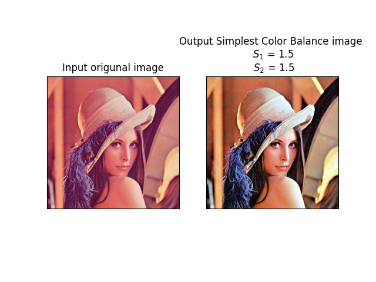

# Simplest Color Balance
This is a Python implementation of [Simplest Color Balance](https://github.com/nilx/simplest_color_balance) by:
- Nicolas Limare
- Jose-Luis Lisani
- Jean-Michel Morel
- Ana Belén Petro
- Catalina Sbert

## Online demo of authors

To review the work of the authors of your algorithm click on this link [online demonstration](https://ipolcore.ipol.im/demo/clientApp/demo.html?id=51#0).

## Algorithm

The algorithm applies to images with pixel values in 8-bit integer space (min = 0, max = 255).

## Use this repository

```sh
$ git clone https://github.com/JCLArriaga5/simplest-color-balance-python.git
```

Enter the path where the repository was cloned and install the dependencies with the following command:
```sh
$ pip install -r requirements.txt
```

## Example
Choose the percentage of pixels saturated to black (s1) and white (s2). For example, if you choose s1=1.5% and s=1.5% then the 1.5% darkest pixels in each channel will be saturated to black, and the brightest 1.5% to white.

```Python
img = mpimg.imread('./images/lenna.png')

  s1 = 1.5
  s2 = 1.5

  print('Wait...')
  out = scb(img, s1, s2)
  plotresult(img, out)
```

<p align="center"></p>

# References
- Limare, N., Lisani, J.L., Morel, J.M., Petro, A., & Sbert, C. (2011). Simplest Color Balance. Image Processing On Line, 1, 297–315.
